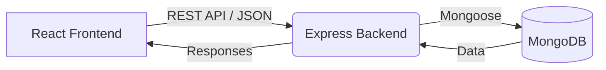

# Clubora 🚀

A comprehensive club management and recruitment platform built with the MERN stack (MongoDB, Express.js, React, Node.js). 

## 📖 Overview
Clubora streamlines the process of managing university/college clubs, handling recruitments, and building dynamic application forms. With a powerful backend and an intuitive frontend, administrators can effortlessly create recruitment drives, build custom application forms, and manage student responses.

## ✨ Features
- **Dynamic Form Builder**: Create custom forms with various field types.
- **Recruitment Management**: Launch and manage recruitment drives easily.
- **Application Tracking**: View and manage candidate applications.
- **Secure Authentication**: JWT-based authentication with bcrypt password hashing.
- **Data Export**: Export application data to PDF (jsPDF) or Excel (xlsx).
- **File Uploads**: Support for resume or document uploads via Multer.

## 🏗️ System Architecture
The application follows a standard client-server architecture:

- **Frontend (Client)**: Built with React and Vite. It provides an interactive UI for users and administrators. State management and routing are handled via React Router. It communicates with the backend via RESTful APIs using Axios.
- **Backend (Server)**: A Node.js and Express server that handles business logic, authentication, and API routing.
- **Database**: MongoDB (accessed via Mongoose) is used to store user data, club information, form schemas, and recruitment responses.



## 💻 Tech Stack

### Frontend
- **Framework**: React 19, Vite
- **Routing**: React Router DOM
- **HTTP Client**: Axios
- **Icons**: Lucide React
- **Utilities**: jsPDF, xlsx

### Backend
- **Runtime**: Node.js
- **Framework**: Express.js
- **Database**: MongoDB & Mongoose
- **Authentication**: JSON Web Tokens (JWT), bcrypt
- **Validation**: Zod
- **File Handling**: Multer

---

## 🚀 How to Run Locally

Follow these steps to set up the project on your local machine.

### Prerequisites
- [Node.js](https://nodejs.org/) (v18 or higher recommended)
- [MongoDB](https://www.mongodb.com/) (Local instance or MongoDB Atlas URI)

### 1. Clone the Repository
```bash
git clone <repository-url>
cd Clubora
```

### 2. Backend Setup
1. Navigate to the backend directory:
   ```bash
   cd backend
   ```
2. Install dependencies:
   ```bash
   npm install
   ```
3. Environment Variables:
   Create a `.env` file in the `backend` directory based on the provided `.env.example`. You will need to add:
   ```env
   PORT=5000
   MONGODB_URI=your_mongodb_connection_string
   JWT_SECRET=your_jwt_secret
   ```
4. Start the backend development server:
   ```bash
   npm run dev
   ```
   *The server should now be running on `http://localhost:5000`.*

### 3. Frontend Setup
1. Open a new terminal and navigate to the frontend directory from the project root:
   ```bash
   cd frontend
   ```
2. Install dependencies:
   ```bash
   npm install
   ```
3. Environment Variables (if required):
   Create a `.env` file in the `frontend` directory if you need to configure the backend API URL (e.g., `VITE_API_URL=http://localhost:5000`).
4. Start the frontend development server:
   ```bash
   npm run dev
   ```
   *The application should now be accessible at `http://localhost:5173` (or the port Vite provides).*

## 📂 Folder Structure

```text
Clubora/
├── backend/               # Node.js/Express Server
│   ├── src/
│   │   ├── controllers/   # Route controllers (e.g., applicationController)
│   │   ├── models/        # Mongoose schemas (e.g., FormResponse)
│   │   ├── routes/        # API endpoints (e.g., forms, recruitments)
│   │   └── index.js       # Entry point
│   ├── .env               # Environment variables
│   └── package.json       # Backend dependencies
│
└── frontend/              # React/Vite Client
    ├── src/
    │   ├── components/    # Reusable UI components (e.g., FormBuilder)
    │   ├── App.jsx        # Main React component
    │   └── main.jsx       # Entry point
    └── package.json       # Frontend dependencies
```

## 🤝 Contributing
1. Fork the repository
2. Create a new branch (`git checkout -b feature/your-feature-name`)
3. Commit your changes (`git commit -m 'Add some feature'`)
4. Push to the branch (`git push origin feature/your-feature-name`)
5. Open a Pull Request

## 📄 License
This project is licensed under the MIT License.
